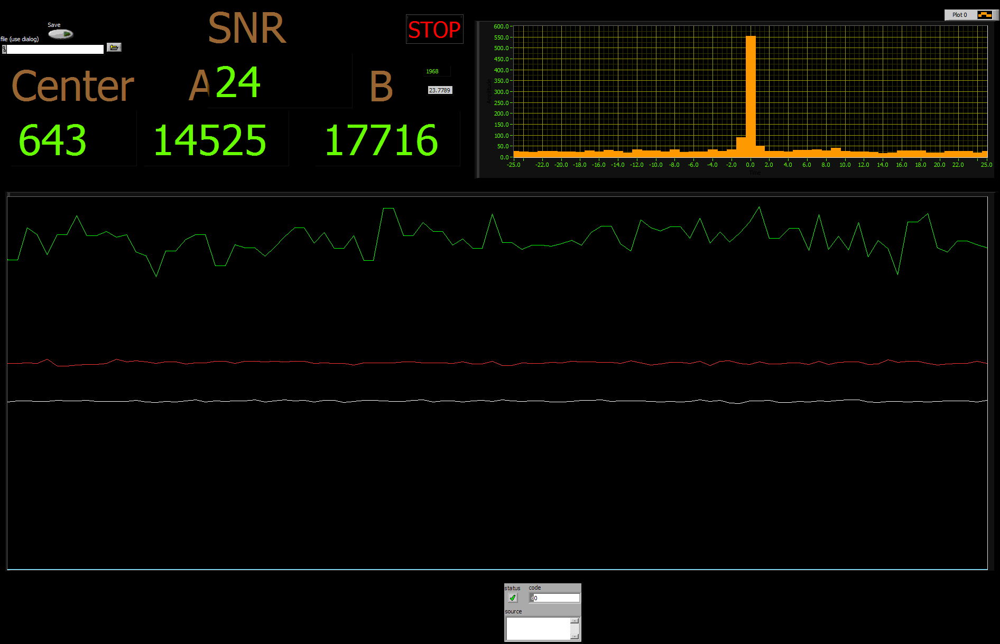

# How to connect APD to computer and voltage?

1. Connect APD to voltage power. Use 3 CV channels for generator where voltage: (30V 0.01A, 5V 0.2A, 2V 1A) and maximal power for each channel (1.2W, 5W, 6W). 
I recommend to turn on all channels at once. For some reason our generator turns on channel with 2V in CC mode, to change it to CV one needs to quickly start changing current until it changes. Don't go above 2A

2. Our APD has 4 channels for fibres. Here are used first and last channel. Those channels have connected BNC cables that one should connect to FPGA on the zero and first channel. Then connect FPGA to computer (The one that is far away from our setup in our case)

3. To turn on the program for coincidence logic turn on the LabVIEW 2018 (I am not sure rn) and go to folder named Jakub. When you turn on the project, turn on the "main tagging" program

# How to use the program 

Let's describe front pannel of the program that looks like this:

Let's start from the values in the upper left corner. For all the values the time of accumulation is 0.1 second. First under SNR you can see signal to noise ratio. This compares highest peak with the noise. Then there are two values under A nad B those are counts for each APD that is connected- single counts. On the left from that we have center value, this is the value of coincidences-thus how many signals went to FPGA simultanuesly from both of the APDs. Next under it one can see big line plot, where red and white line corresponds to single counts of each channel. Green line corresponds to coincidences. Important! scale for green line here is not the same as for single counts. Next we have histogram. Here one of the channels is describe as reference point and then we see what is the delay of arrival for the signal in second channel. This way if one see peak at 0 time will be sure that signals arrives simultanouesly, this way we see negative time that the second channel arrives faster then the reference channel. Binning of time is set as 10 nanoseconds.

There is a button to save file, this will save in binary format the data. I didn't figure out how read it properly and what it shows.

# Some values of the source we have now and how we got it:

First to get any counts we used back propagation method to couple into fibers for each APD. Then we putted long pass filters and turned on the program and APD. We started looking for photons with setted temperature of the crystal around 32 Celcuis. By looking at the counts we could better couple to the fiber (maximize the number of single counts on each arm). Find the best polarization by maximizing the counts as well. Find laser power of the beam that will be high enough so the source will start working, then tune the temperature. In ideal world the temperature setted depends on the pump wavelength so changing the power should not matter, in our case with changing the power the laser changes the wavelength. When you see some counts it it only matter of coupling, the better you couple the better result will be.

Our values:
Laser power - 115.5mW
temperature - 30.51 Celcius
maximal counts - 290 000/1s
coincidence/counts ratio -around 10%

